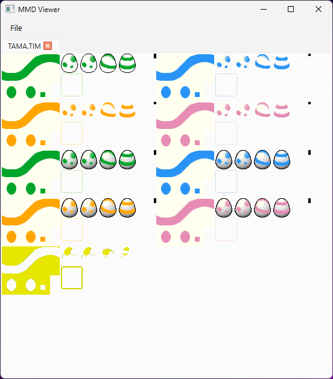
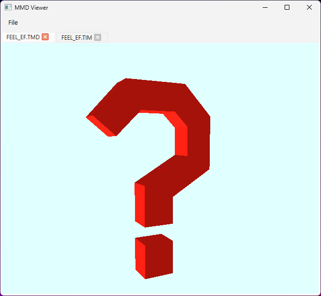
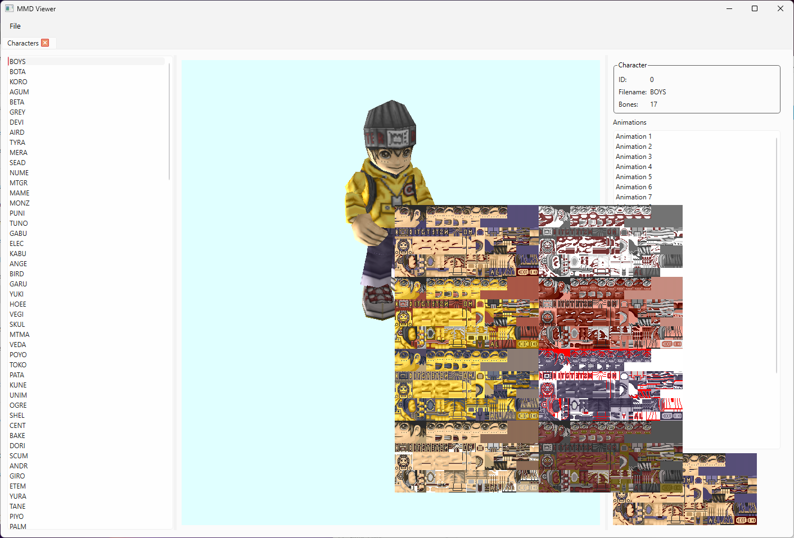

# MMD viewer

This is another (work-in-progress) character viewer for Digimon World 1. 
Heavily inspired by [digimon_world_1_character_viewer](https://github.com/marceloadsj/digimon_world_1_character_viewer),
written using extremely useful information found in SydMontague's [DW1ModelConverter](https://github.com/Operation-Decoded/DW1ModelConverter).

This viewer is written in C++, using the Qt framework.
3D rendering is done using the OpenGL APIs provided by Qt.

Motivation for writing another viewer was to get familiar with 
the model's format and having one as a desktop application, 
making it easier to debug and add new features.

Current features:
- open TIM and TMD files
- open `SLUS_010.32` (the PSX executable for the US version of the game):
  - list all character models and their animations

Camera controls (3D viewers):
- mouse wheel for zooming in/out
- mouse move while holding the right button for rotating around the model

## Screenshots

